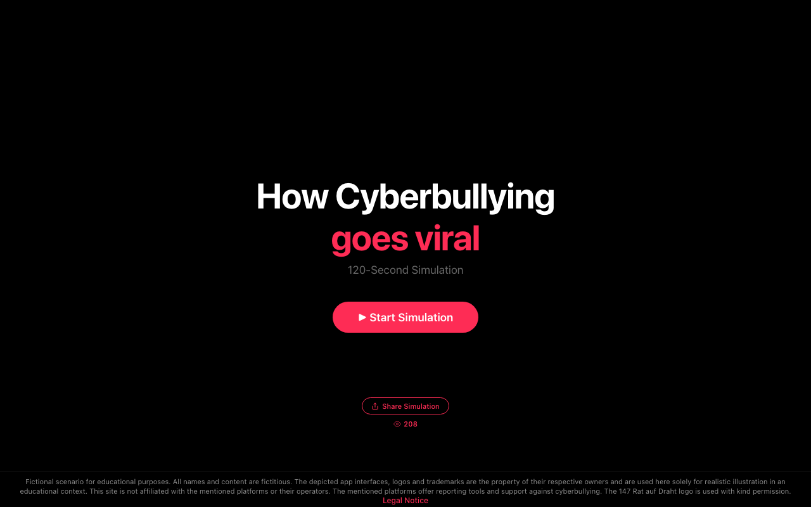

# Cybermobbing Simulation

Eine interaktive 120-Sekunden-Simulation, die zeigt, wie schnell Cybermobbing viral geht. Entwickelt fuer Workshops an Schulen.

**[Live-Demo](https://cybermobbing.web.app)**



## Was ist das?

Die Simulation durchlaeuft 5 Phasen -- von der ersten WhatsApp-Nachricht bis zum viralen TikTok-Video -- und zeigt in Echtzeit, wie sich Cybermobbing ausbreitet. Am Ende werden Hilfsangebote eingeblendet.

**Phasen:** WhatsApp -> Instagram -> TikTok -> Homescreen -> iMessage -> Hilfsangebote

Konzipiert fuer den Einsatz in Schulworkshops: pausierbar, diskutierbar, wirkungsvoll.

## Features

- 5 realistische App-Szenen (WhatsApp, Instagram, TikTok, Homescreen, iMessage)
- Pausierbar fuer Workshop-Diskussionen
- View-Counter (Firebase Realtime Database)
- Teilen-Button
- Mehrsprachig (i18n: Deutsch + Englisch)
- Kein Build-Step noetig

## Live Demo

[https://cybermobbing.web.app](https://cybermobbing.web.app)

## Setup fuer Forks

1. Repository klonen
2. `bash setup.sh` -- laedt App-Icons herunter
3. `cp js/config.example.js js/config.js` -- Firebase-Konfiguration anpassen
4. Firebase-Projekt erstellen + Realtime Database aktivieren
5. `database.rules.json` deployen
6. `firebase deploy`

## Architektur

```
js/
  i18n.js              — Uebersetzungssystem
  audio.js             — Sound-Engine + pausierbares Timer-System
  helpers.js           — Avatar-System + UI-Helfer
  timer.js             — Fortschrittsbalken + Uhr
  config.js            — Firebase-Konfiguration (nicht im Repo)
  firebase-counter.js  — View-Counter + Tageslimit
  main.js              — Entry Point + Share
  scenes/
    p1-whatsapp.js     — Phase 1: WhatsApp (0–28s)
    p2-instagram.js    — Phase 2: Instagram (28–56s)
    p3-tiktok.js       — Phase 3: TikTok (56–78s)
    p4-homescreen.js   — Phase 4: Homescreen (78–93s)
    p4b-messages.js    — Phase 4b: iMessage (93–112s)
    p5-finale.js       — Phase 5: Finale (112–120s)
```

## Neue Sprache hinzufuegen

1. In `js/i18n.js` einen neuen Block unter `TRANSLATIONS` hinzufuegen (z.B. `fr: { ... }`)
2. Alle Keys aus `de` uebersetzen -- Charakter-Stimmen beibehalten (z.B. Sara schreibt in CAPS)
3. URL-Parameter `?lang=fr` verwenden oder `navigator.language` wird automatisch erkannt
4. Meta-Tags in `index.html` manuell uebersetzen (SEO)
5. Impressum muss vom jeweiligen Betreiber ersetzt werden

## Tests

`tests/test-runner.html` im Browser oeffnen. Verwendet QUnit (kein npm noetig).

## Impressum

Das Impressum in `index.html` ist betreiberspezifisch (oesterreichisches Recht). Forks **muessen** es durch ihr eigenes ersetzen.

## App-Icons

Die Icons in `assets/icons/` sind Markenzeichen der jeweiligen Unternehmen (Meta, ByteDance, Snap, Apple). Sie werden nur zu Bildungszwecken verwendet (Paragraph 42f UrhG). Sie sind **nicht** unter der MIT-Lizenz lizenziert und werden ueber `setup.sh` heruntergeladen, nicht im Repository verteilt.

## Musik

`assets/bgm.mp3` wurde mit Suno Pro erstellt (kommerzielle Nutzung erlaubt).

## Credits

malziland -- digitale Wissensgestaltung e.U.

## Lizenz

MIT -- siehe [LICENSE](LICENSE)
